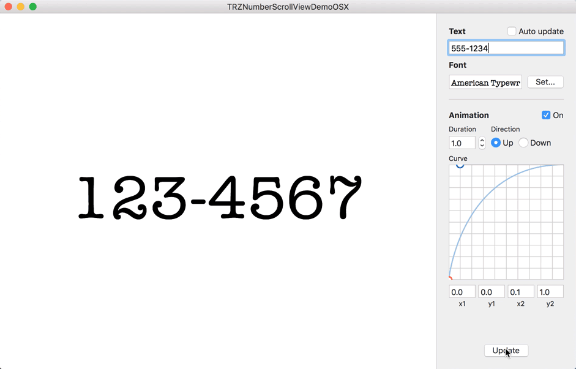

TRZNumberScrollView
===
An efficient animated number scrolling view for iOS and OS X.



Why?
---
I had been using [JTNumberScrollAnimatedView](https://github.com/jonathantribouharet/JTNumberScrollAnimatedView) for my app [2STP](https://geo.itunes.apple.com/us/app/2stp-authenticator/id954311670?ls=1&mt=8), but there are some significant performance issues with that implementation (specifically, the allocation of a `UILabel` for each digit, causing pauses when they get released). This is a entirely separate implementation of approximately the same effect.

This implementation uses `CALayer`s that share their image contents, making it suitable for extremely memory-constrained scenarios, such as in Notification Center widgets. It also plays better with Auto Layout. Finally, it's cross-platform, thanks to most of the code being implemented at the Core Animation level.

Setup
---
1. Drag and drop NumberScrollView.swift into your iOS or OS X project.
2. Rejoice in all the time you didn't have to spend mucking with some configuration file.

Usage
---
```swift
let numberView = TRZNumberScrollView()
//Add to superview, configure constraints etc.
numberView.setText("123456", animated: true, direction: .Up)
```

You can set any text, including non-numeric characters; however, only numeric digits will be animated.

In addition, the view's behavior can be customized via the following properties:
- `font`
- `textColor`
- `animationDuration`
- `animationCurve`

If you intend to set both `font` and `textColor` at the same time, it is recommended that you do so either before setting `text`, or by calling the `setFont(:textColor:)` method, to avoid generating unnecessary images.

The included demo project for OS X lets you play with these parameters so you can tweak the behavior to your liking. 

Notes
---
By default, generated images are cached in a global, thread-safe cache on iOS (images are not cached by default on OS X). However, you can override this behavior by setting the `imageCachePolicy` property on the `NumberScrollView`, or by setting the `imageCache` property on a `NumberScrollLayer` to an appropriate value.

The default cache implementation on iOS automatically evicts its unused contents when the app is backgrounded or when the app receives a memory warning. The default cache on OS X does not automatically evict its unused contents, but you can do so manually by calling `NumberScrollLayer.evictGlobalImageCache()`.
